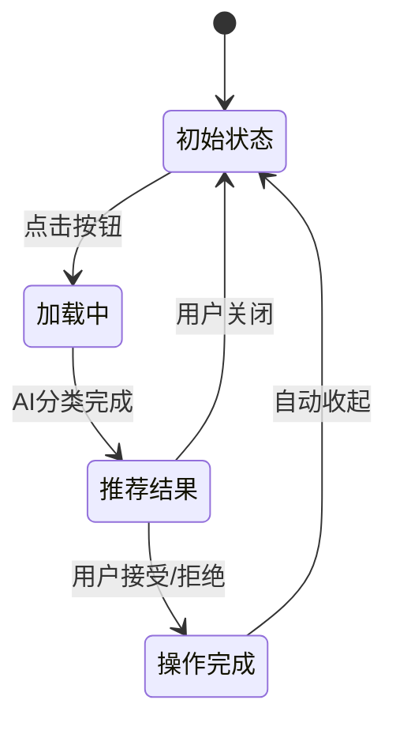

# 沉浸式侧边按钮设计方案

## 1. 项目概述

### 1.1 背景
当前B站收藏夹分类器在用户进入视频页面时会自动触发AI分类流程，显示悬浮推荐窗口。用户希望改为类似沉浸式翻译的侧边按钮形式，只有点击按钮后才开始AI分类，而不是每个视频都自动触发。

### 1.2 目标
- 设计一个固定在页面右侧的侧边按钮，类似沉浸式翻译的样式
- 实现点击按钮后才触发AI分类的交互流程
- 保持现有功能完整性，提供更好的用户体验
- 增加设置选项，允许用户选择自动/手动模式

## 2. 设计方案

### 2.1 侧边按钮设计

#### 2.1.1 视觉设计
- **位置**：固定在页面右侧中央区域（垂直居中）
- **尺寸**：宽度48px，高度120px（适合单手点击）
- **样式**：
  - 半透明背景（rgba(255, 255, 255, 0.8)）
  - 模糊效果（backdrop-filter: blur(8px)）
  - 圆角设计（rounded-2xl）
  - B站粉色主题色（#fb7299）
  - 阴影效果（box-shadow: 0 4px 12px rgba(0, 0, 0, 0.1)）

#### 2.1.2 按钮状态
- **默认状态**：显示AI图标和"AI收藏"文字
- **悬停状态**：背景加深，轻微放大效果
- **点击状态**：缩小效果，触发动画
- **加载状态**：显示加载动画，文字变为"分析中"
- **完成状态**：显示完成图标，文字变为"推荐完成"

### 2.2 交互流程

#### 2.2.1 用户操作流程
1. **初始状态**：用户进入视频页面，只显示侧边按钮
2. **点击按钮**：用户点击侧边按钮，触发AI分类流程
3. **分类中**：按钮显示加载状态，同时显示小型加载提示
4. **分类完成**：展开显示推荐结果面板
5. **用户操作**：用户可以选择接受推荐、拒绝推荐或手动选择收藏夹
6. **操作完成**：收起推荐面板，按钮恢复初始状态

#### 2.2.2 状态转换图


## 3. 技术实现方案

### 3.1 组件结构

#### 3.1.1 新增组件
- **SideButton.vue**：侧边按钮组件
  - 负责按钮的显示和交互
  - 管理按钮的各种状态
  - 处理点击事件和动画效果

#### 3.1.2 修改现有组件
- **FloatingRecommendation.vue**：
  - 添加收起/展开状态支持
  - 优化动画效果
  - 调整布局以适应新的交互方式

### 3.2 状态管理

#### 3.2.1 Store 修改
- **floatingRecommendationStore.js**：
  - 添加按钮状态管理
  - 添加自动/手动模式设置
  - 优化推荐流程逻辑

#### 3.2.2 新增状态
```javascript
state: () => ({
  // 现有状态...
  buttonMode: 'manual', // 'manual' | 'auto'
  buttonState: 'idle', // 'idle' | 'loading' | 'success' | 'error'
  isPanelExpanded: false,
  // ...
})
```

### 3.3 主入口逻辑修改

#### 3.3.1 main.js 修改
- 修改 `initRealtimeVideoDetection` 方法
- 添加模式判断逻辑
- 实现点击触发机制

#### 3.3.2 UI管理器修改
- 修改 `ui.js` 中的初始化逻辑
- 添加侧边按钮的创建和管理

### 3.4 设置页面修改

#### 3.4.1 新增设置项
- **自动/手动模式选择**：
  - 单选按钮组
  - 保存用户选择到本地存储

#### 3.4.2 设置项结构
```javascript
{
  id: 'recommendationMode',
  type: 'radio',
  options: [
    { value: 'auto', label: '自动推荐（进入视频页面自动分析）' },
    { value: 'manual', label: '手动推荐（点击按钮开始分析）' }
  ],
  default: 'manual'
}
```

## 4. 样式设计

### 4.1 按钮样式
```css
.side-button {
  position: fixed;
  right: 20px;
  top: 50%;
  transform: translateY(-50%);
  width: 48px;
  height: 120px;
  background: rgba(255, 255, 255, 0.8);
  backdrop-filter: blur(8px);
  border-radius: 24px;
  display: flex;
  flex-direction: column;
  align-items: center;
  justify-content: center;
  gap: 8px;
  cursor: pointer;
  z-index: 10000;
  transition: all 0.3s cubic-bezier(0.4, 0, 0.2, 1);
  box-shadow: 0 4px 12px rgba(0, 0, 0, 0.1);
  border: 1px solid rgba(255, 255, 255, 0.2);
}

.side-button:hover {
  background: rgba(255, 255, 255, 0.95);
  transform: translateY(-50%) scale(1.05);
  box-shadow: 0 6px 16px rgba(0, 0, 0, 0.15);
}
```

### 4.2 推荐面板样式
- 保持现有样式的基础上
- 添加平滑的展开/收起动画
- 优化阴影和层级关系
- 添加响应式设计

## 5. 实现计划

### 5.1 开发阶段
1. **第一阶段**：创建侧边按钮组件
2. **第二阶段**：修改悬浮推荐组件
3. **第三阶段**：更新状态管理和主逻辑
4. **第四阶段**：添加设置选项
5. **第五阶段**：优化动画和响应式设计
6. **第六阶段**：测试和文档更新

### 5.2 测试计划
- 功能测试：确保所有交互流程正常工作
- 兼容性测试：在不同浏览器和设备上测试
- 性能测试：确保动画流畅，不影响页面性能
- 用户体验测试：收集用户反馈，优化交互体验

## 6. 风险评估

### 6.1 技术风险
- 现有功能可能受到影响
- 新的交互方式可能存在兼容性问题
- 性能问题：动画和状态管理可能影响页面性能

### 6.2 解决方案
- 充分测试现有功能，确保不受影响
- 使用渐进增强的方式实现新功能
- 优化动画性能，使用硬件加速

## 7. 后续优化

### 7.1 功能扩展
- 添加快捷键支持
- 实现拖拽调整按钮位置
- 添加更多自定义选项

### 7.2 性能优化
- 优化AI分类速度
- 减少不必要的重渲染
- 优化内存使用

## 8. 总结

本设计方案详细描述了如何将现有的自动悬浮推荐功能改为沉浸式侧边按钮交互方式。通过引入侧边按钮组件，修改现有组件和状态管理，添加设置选项，可以实现更好的用户体验。整个方案保持了现有功能的完整性，同时提供了更灵活的交互方式。

该方案采用渐进式开发方式，可以分阶段实现，降低开发风险。同时，通过充分的测试和优化，确保新功能的稳定性和性能。